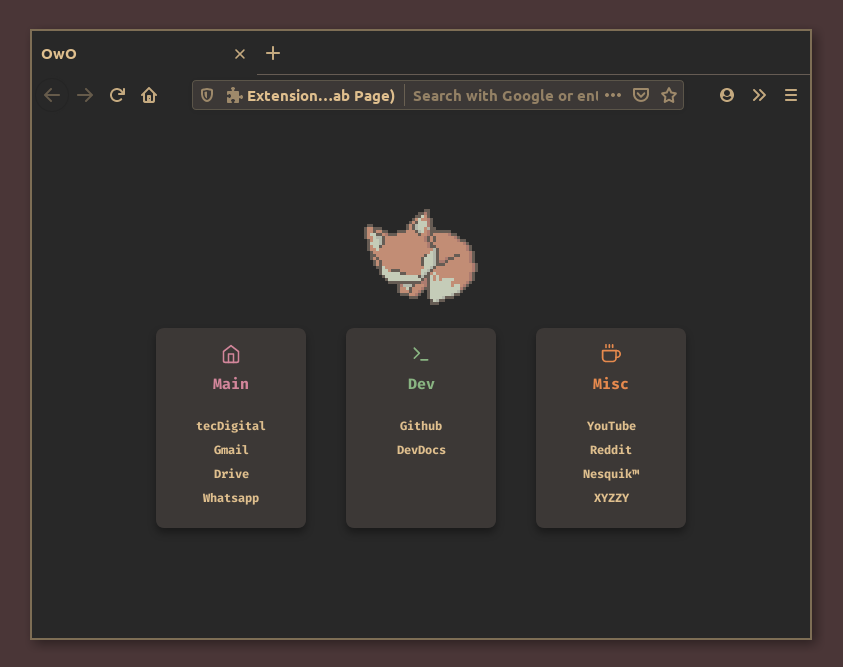

# gruv-firefox
This is my fork of daaniieel's nord-firefox theme: https://github.com/daaniiieel/nord-firefox
 I just adjusted the palette to match the gruvbox colorscheme.
### Recommended GTK themes
* Gruvbox Material Dark: https://github.com/sainnhe/gruvbox-material-gtk
* Elkowar's Phocus-Phork: https://github.com/elkowar/gtk
## Other links
* The startpage on the preview: https://github.com/milliways-png/foxx-startpage
* Gruvbox: https://github.com/morhetz/gruvbox
* Gruvbox Material: https://github.com/sainnhe/gruvbox-material

